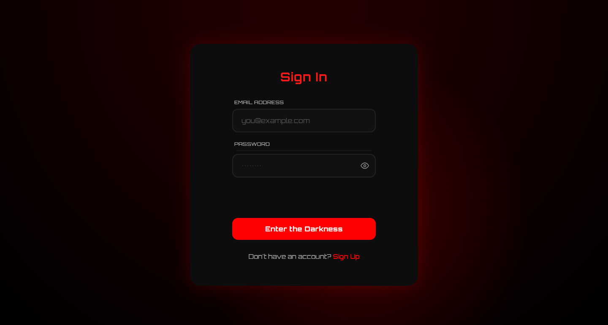

# Dark Red Auth

# Overview

A dark, immersive dual-form authentication component that handles both Sign In and Sign Up flows in a single file. Built with a moody red-and-black aesthetic, it features real-time password strength analysis, live validation, and full keyboard accessibility without relying on any external frameworks or build tools.

# Preview

```md

```

# Features

- **Dual-form layout** — Sign In and Sign Up forms share the same container with animated transitions between them
- **Real-time password strength meter** — Visual bar with color-coded feedback and a descriptive label that updates on every keystroke
- **Live requirement checklist** — Six password rules displayed as a checklist that marks items complete as the user types
- **Password visibility toggles** — Show/hide buttons on every password field with proper ARIA state management
- **Common password blacklist** — Rejects well-known weak passwords like "password123" and "qwerty123" during validation
- **Simulated submission flow** — Loading spinners on the submit buttons and animated success banners after a short delay
- **Mouse-reactive glow** — A soft red spotlight follows the cursor inside the form card (disabled for touch users)
- **Ambient background animation** — A slow-drifting radial glow behind the form to add depth without distraction
- **Screen-reader support** — Dedicated live region for announcing form errors and success states

# Validation

- **Email** — Required; validated against an RFC 5322-inspired pattern with a 254-character limit
- **Sign In password** — Required; must be at least 8 characters
- **Full name (Sign Up)** — Required; trimmed to remove whitespace, must be between 2 and 80 characters
- **Sign Up password** — Required; minimum 8 characters, cannot contain spaces, must include at least one uppercase letter, one lowercase letter, one number, and one special character; also checked against a blacklist of common passwords
- **Confirm password** — Required; must match the Sign Up password exactly, checked in real time as the user types
- **Blur validation** — Fields are validated when the user leaves them, with error states clearing automatically once the input becomes valid
- **Submit validation** — On submission, every field is re-checked; if errors exist, focus moves to the first invalid field and a summary is announced to assistive technology
- **Input sanitization** — Angle brackets are stripped from all text inputs to prevent basic markup injection

# UI/UX Highlights

- **Dark red aesthetic** — Deep blacks, radial red gradients, and the Orbitron typeface give the form its distinct "Hell Auth" look
- **Smooth form switching** — Clicking the switch link cross-fades the title, swaps the forms with a slide animation, and staggers the entrance of each input field
- **Consistent button placement** — A hidden spacer field keeps the submit button vertically aligned between the two forms so the layout doesn't jump when switching
- **Visual feedback states** — Error fields glow red and success fields glow green, giving immediate context without reading the message text
- **Animated success banners** — A green confirmation banner slides in after a successful "submission" (simulated) to confirm the action
- **Reduced motion support** — Respects `prefers-reduced-motion` by disabling the floating background and form animations for users who need a static interface

# Responsive Design

- **Fluid container** — The form card maxes out at 540px and scales down to 95% viewport width on small screens
- **Three breakpoints** — 768px, 480px, and 360px, each reducing padding, font sizes, and spacing proportionally
- **Mobile-optimized checklist** — The password requirement grid collapses to a single column on screens below 480px for readability
- **Touch-friendly targets** — Inputs and buttons maintain comfortable tap sizes across all breakpoints

# Technologies

- HTML5
- CSS3 (Custom Properties, Grid, keyframe animations, media queries)
- Vanilla JavaScript (ES6+, strict mode, no frameworks)
- Google Fonts — Orbitron
- Inline SVG icons

# Folder Structure

```text
DarkRedAuth/
├── index.html
├── README.md
└── cover.png
```

# Getting Started

No installation or build step is required. Open `index.html` directly in any modern web browser. Everything is self-contained in a single file.

# Browser Support

- Chrome, Firefox, Safari, and Edge (latest stable releases)
- Keyboard navigation fully supported with visible focus indicators
- Respects system-level reduced-motion preferences

# Future Improvements

- Wire the simulated `setTimeout` submission to a real authentication API
- Add a "Forgot Password?" link and reset flow on the Sign In form
- Include a "Remember Me" checkbox for session persistence
- Add CAPTCHA or honeypot fields to mitigate automated sign-up abuse
- Cache form state in `sessionStorage` so accidental refreshes don't wipe user input

# License

MIT
