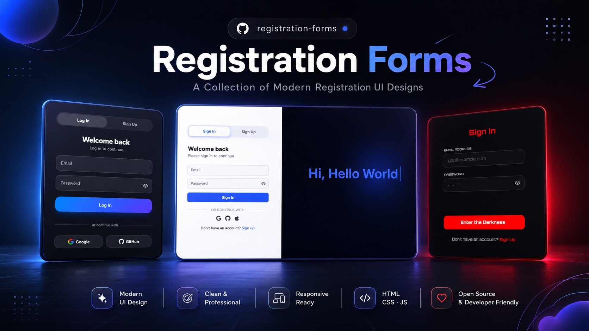

<div align="center">

# Registration Forms

A curated collection of production-ready authentication interfaces. Each project explores a different visual language, validation strategy, and interaction model — all built as self-contained, single-file components that work out of the box.

[](https://developer.mozilla.org/en-US/docs/Web/HTML)
[](https://developer.mozilla.org/en-US/docs/Web/CSS)
[](https://developer.mozilla.org/en-US/docs/Web/JavaScript)
[](.)
[](LICENSE)

</div>

---

# Preview

<p align="center">
  
</p>

# About This Collection

Every project in this repository is a complete, standalone registration form. They share no dependencies, no build steps, and no external frameworks — just clean HTML, CSS, and JavaScript.

The goal is to show how much variety is possible within a seemingly simple UI pattern. One form leans into a dark, immersive gaming aesthetic. Another splits the screen between branding and functionality. A third uses glassmorphism and system-aware dark mode. Each one handles validation, responsiveness, and accessibility differently, giving you a range of approaches to study, compare, and adapt.

Whether you are looking for a drop-in auth component, a reference for validation logic, or inspiration for your own design system, there is something here worth taking apart.

# Included Projects

| Project | Design Style | Validation Style | Responsive | Folder |
|---------|--------------|------------------|------------|--------|
| **DarkRedAuth** | Dark red / black immersive aesthetic with reactive glow and ambient animations | Real-time password strength meter with a six-rule checklist and common-password blacklist | Yes | `DarkRedAuth/` |
| **EnterpriseAuth** | Split-screen layout — dark branded left panel, clean white right panel | Silent border-only feedback; live validation on every keystroke | Yes | `EnterpriseAuth/` |
| **ModernAuth** | Glassmorphism card with floating labels and automatic dark mode support | Real-time validation with color-coded rings, animated status icons, and a four-segment strength meter | Yes | `ModernAuth/` |

# Highlights

- **Multiple design languages** — From moody reds and neon glows to crisp enterprise splits and translucent glass cards
- **Real-time validation** — Every form validates as you type, with visual feedback that ranges from subtle borders to detailed strength analysis
- **Password visibility toggles** — All password fields include show/hide controls
- **Accessibility considerations** — ARIA attributes, focus management, reduced-motion support, and screen-reader live regions where appropriate
- **Smooth animations** — Form transitions, button states, loading spinners, success overlays, and ambient background motion
- **Responsive layouts** — Each form adapts from desktop to mobile with dedicated breakpoints and fluid sizing
- **Zero dependencies** — No build tools, no frameworks, no package managers. Open the HTML file and it runs.

# Technologies

- HTML5
- CSS3 (Custom Properties, Flexbox, Grid, `backdrop-filter`, `color-mix()`, keyframe animations, media queries)
- Vanilla JavaScript (ES5/ES6+, strict mode, no frameworks)
- Google Fonts (Orbitron, Inter)
- Font Awesome 6.5.0 (EnterpriseAuth)
- Inline SVG icons

# Project Structure

```text
registration-forms/
├── README.md
├── LICENSE
├── Cover.png
│
├── DarkRedAuth/
│   ├── index.html
│   ├── README.md
│   └── cover.png
│
├── EnterpriseAuth/
│   ├── index.html
│   ├── README.md
│   └── cover.png
│
└── ModernAuth/
    ├── index.html
    ├── README.md
    └── cover.png
```

# Getting Started

Each project is completely self-contained. To run any form locally:

```bash
git clone https://github.com/yourusername/registration-forms.git
cd registration-forms/DarkRedAuth   # or EnterpriseAuth / ModernAuth
open index.html
```

No server, no bundler, no npm install. Just open the file in your browser.

# Browser Support

- Chrome, Firefox, Safari, and Edge (latest stable releases)
- Designed for modern browsers that support CSS `backdrop-filter`, `color-mix()`, `clamp()`, and standard ES6 APIs
- Respects `prefers-reduced-motion` and `prefers-color-scheme` where implemented

# Contributing

This collection is meant to grow. If you would like to contribute, here are a few ways to help:

- **Improve existing forms** — Tighten validation logic, refine responsive behavior, or polish animation timing
- **Add new designs** — Submit a new folder with a completely different visual approach (material, brutalist, neumorphism, etc.)
- **Enhance accessibility** — Add missing ARIA labels, improve keyboard navigation, or test with screen readers
- **Strengthen validation** — Add password breach checking, stricter email verification, or international phone number support
- **Optimize performance** — Reduce repaint costs, simplify selectors, or cut unnecessary JavaScript
- **Share ideas** — Open an issue with a reference design or interaction pattern you would like to see implemented

# Future Improvements

- Multi-step registration wizards
- Social authentication buttons wired to real OAuth flows
- Passkey / WebAuthn support
- OTP verification step after signup
- RTL language support
- Internationalization (i18n) for labels and error messages
- Form state persistence across accidental refreshes
- "Forgot password" and "Reset password" flows

# License

MIT License — see [LICENSE](./LISENSE) for details.
